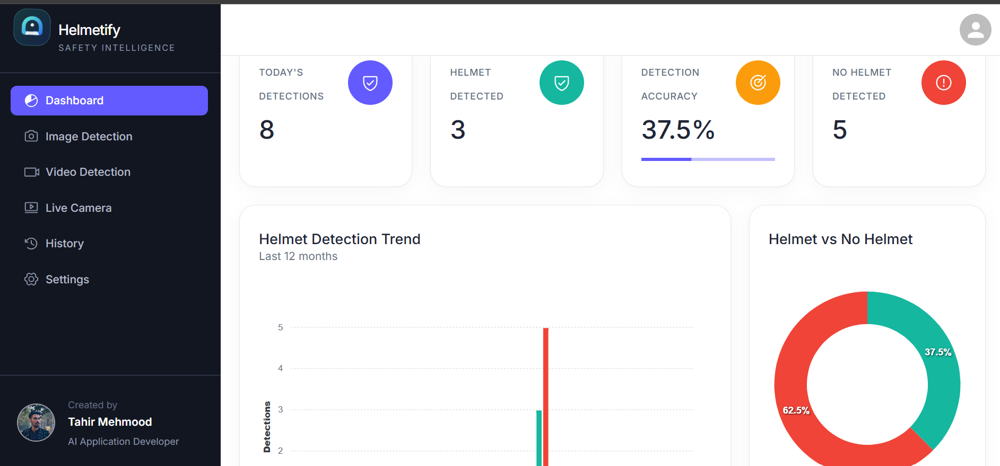

# 🪖 Helmetify — AI-Powered Helmet Detection System

Helmetify is a full-stack AI-powered helmet detection application that detects whether a person is wearing a helmet using a custom-trained object detection model.

The application supports image detection, video detection, and live camera detection, along with user authentication, detection history, dashboard statistics, and profile management.

## 🚀 Live Demo

🌐 **Live Application:** https://helmetify.vercel.app


> Note: The AI inference backend is deployed separately from the frontend.

---

## ✨ Features

### 🤖 AI Detection

* Helmet detection using a custom-trained YOLO model
* `with_helmet` and `without_helmet` classification
* Confidence scores for detections
* Bounding-box visualization
* Multiple detections in a single image

### 📷 Image Detection

* Upload an image
* Run AI inference
* Display detection results
* Generate an annotated image
* Save detection history

### 🎥 Video Detection

* Upload a video
* Process video frames using the AI model
* Generate an annotated output video
* Store detection information in history

### 📹 Live Camera Detection

* Capture frames from the user's webcam
* Send frames to the backend
* Run helmet detection in real time
* Display detected objects and confidence scores

### 🔐 Authentication

* User registration
* User login
* Authentication-protected API endpoints
* User profile management
* Profile picture upload

### 📊 Dashboard

* Detection statistics
* Detection history
* Helmet / no-helmet results
* Detection confidence information
* User-specific records

### 🗄️ Database

* PostgreSQL database
* SQLAlchemy ORM
* Neon PostgreSQL for production
* User-specific detection history

### ☁️ Deployment

* Frontend deployed on Vercel
* Backend deployed on Render
* Database hosted on Neon
* ONNX Runtime used for lightweight production inference

---

## 🏗️ Architecture


---

## 🛠️ Tech Stack

### Frontend

* Next.js
* React
* TypeScript
* Tailwind CSS
* REST API integration

### Backend

* Python
* FastAPI
* SQLAlchemy
* OpenCV
* ONNX Runtime

### AI / Computer Vision

* YOLO
* Custom-trained helmet detection model
* ONNX model deployment
* OpenCV image and video processing

### Database

* PostgreSQL
* Neon
* SQLAlchemy ORM

### Deployment

* Vercel
* Render
* Neon

---

## 🧠 AI Model

Helmetify uses a custom-trained object detection model with two classes:

```text
0 → with_helmet
1 → without_helmet
```

The model was initially trained using the Ultralytics YOLO framework.

For production deployment, the trained model was exported to ONNX and inference was moved to ONNX Runtime.

This significantly reduces the runtime dependency footprint compared with running the complete PyTorch + Ultralytics inference stack in the production backend.

---

## 🔄 Detection Workflow

### Image Detection

```text
Upload Image
     ↓
Next.js Frontend
     ↓
FastAPI Backend
     ↓
Image Preprocessing
     ↓
ONNX Runtime
     ↓
Object Detection
     ↓
Non-Maximum Suppression
     ↓
Annotated Image
     ↓
Detection Result
     ↓
PostgreSQL History
```

### Video Detection

```text
Upload Video
     ↓
FastAPI
     ↓
Read Video Frames
     ↓
ONNX Inference
     ↓
Draw Bounding Boxes
     ↓
Generate Annotated Video
     ↓
Save Detection History
```

---

## 📸 Screenshots

### Dashboard




---

## 👨‍💻 Author

**Tahir Mehmood**

BS Data Science

GitHub: https://github.com/tahirds08

---

## ⭐ Support

If you find this project interesting, consider giving the repository a ⭐ on GitHub.
